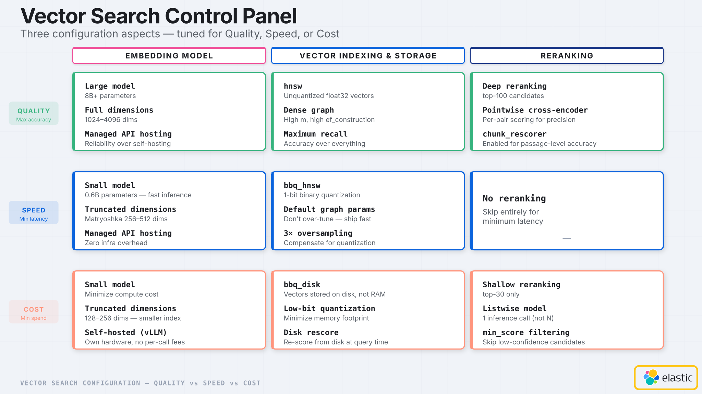
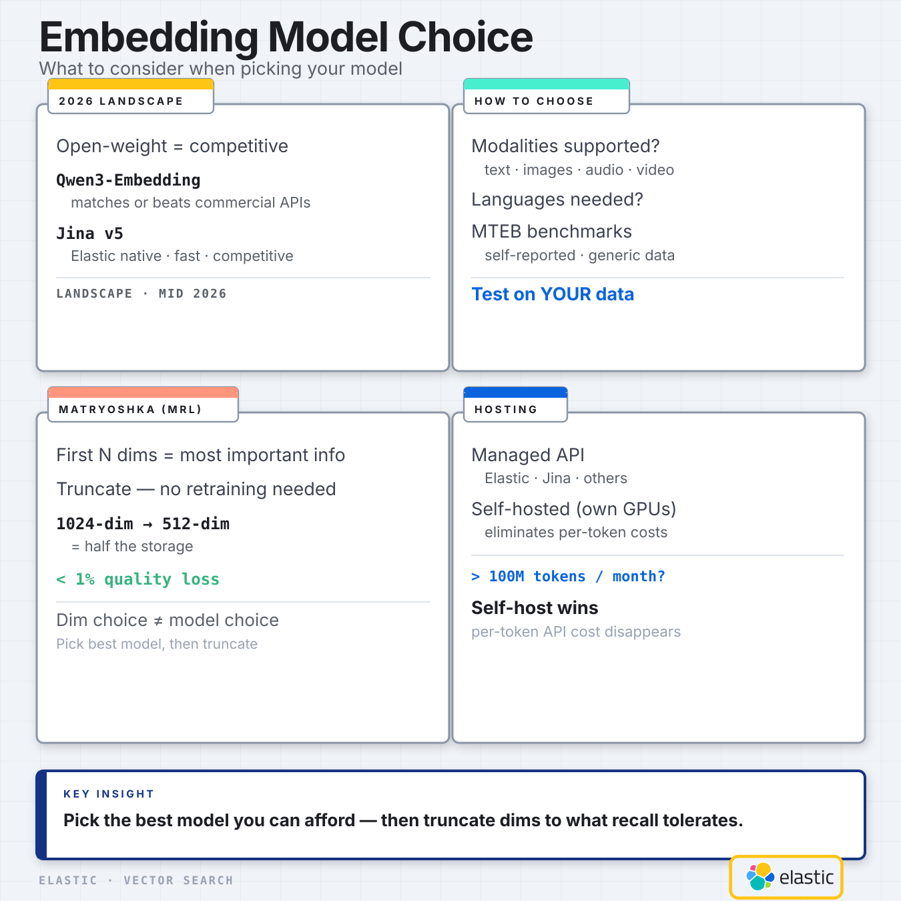
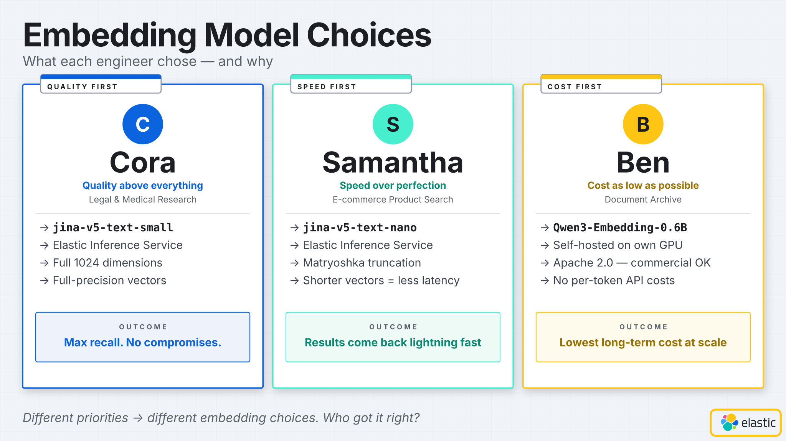
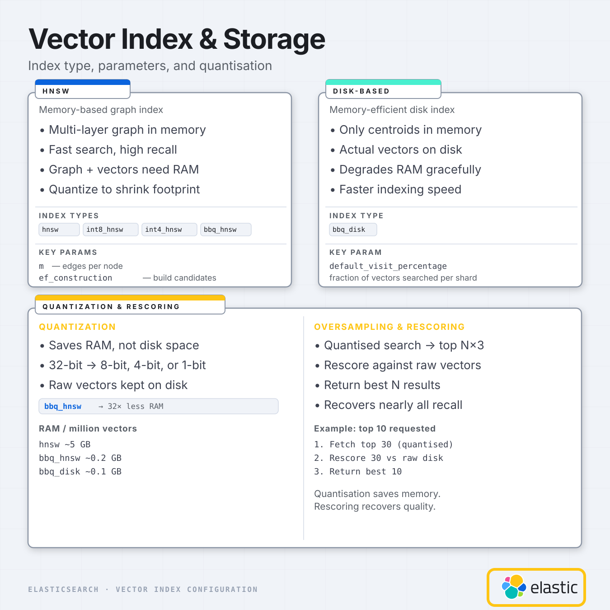
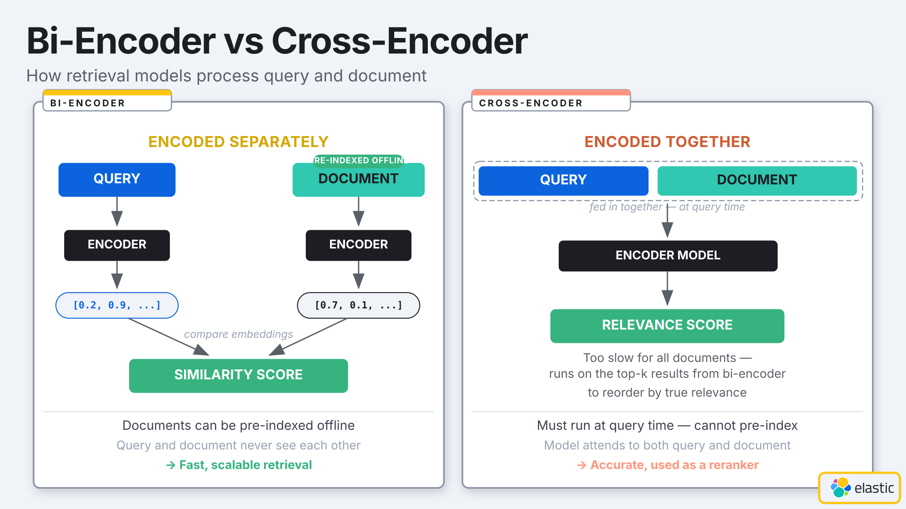

# 3 Engineers, 3 Vector Search Setups — Who's Right?

Three engineers are each building a vector search feature.

One setup costs the most to run. One returns results in milliseconds but makes quality tradeoffs. The third runs almost entirely off disk with a small cloud bill.

Who got it right?

All of them.

This post is a companion to [my latest video](#). I'll walk through the same three configuration decisions — embedding models, vector indexing and storage, reranking — and show how each engineer's constraints lead them to a completely different but completely valid setup. If you prefer the visual walkthrough, watch the video. If you want a reference you can skim and return to, this is it.

---

## The framework: three configuration aspects

Vector search isn't a single dial. It's three independent subsystems, each with its own tradeoffs.

**Embedding model** — which model generates your vectors, how many dimensions, and where inference runs. This has the biggest single impact on search quality and accounts for a large chunk of your costs.

**Vector indexing and storage** — how vectors are stored, compressed, and searched. Index type, quantization, and recovery mechanisms. This determines your memory footprint, which drives infrastructure cost.

**Reranking** — an optional second pass that reads the query and top results together to produce more accurate relevance scores. Trades latency and inference cost for precision.

The defaults — like `semantic_text` in Elasticsearch — are sensible starting points. But understanding what's happening under the hood, and when to override the defaults, is the difference between a search system that works and one that's optimised for *your* specific situation.

Before we go through each aspect, let's meet the engineers.

---

## The personas

**Cora** is building a legal and medical research tool. Around a million documents — dense filings and studies — which produce tens of millions of vectors after chunking. Wrong results have real consequences: a bad case citation, misdirected research. Quality above everything.

**Samantha** runs product search for an e-commerce platform. Millions of SKUs, potentially billions of vectors. Her users are impatient shoppers — every extra millisecond of latency risks a lost conversion. Speed matters more than perfection.

**Ben** is building a document archive. Tens of millions of documents today, potentially hundreds of millions eventually. Most documents are rarely accessed. His users demand competitive pricing. Keep costs as low as possible.

Three completely different constraints. Let's see how they cascade through each decision.

---

## Aspect 1: Embedding model

The embedding model sets the ceiling on your search quality — and represents a significant portion of inference cost. But "choosing a model" is more nuanced than picking the top name off a leaderboard.

### The 2026 landscape

Open-weight models are genuinely competitive now. Qwen3-Embedding matches or beats commercial APIs on retrieval benchmarks. Elastic ships Jina v5 models natively — small, fast, and strong on retrieval tasks out of the box.

The [MTEB leaderboard](https://huggingface.co/spaces/mteb/leaderboard) is a good starting point: it gives you benchmark scores across retrieval tasks, model size, and licensing. A few things to keep in mind when using it: scores are self-reported, benchmarks use generic datasets, and your actual query distribution probably doesn't match them. Use MTEB to build a shortlist, then test on your own data.

Before settling on a model, check:
- **Modalities**: does it support what you need to embed? Text only, or also images, audio, video?
- **Languages**: does it support your users' languages?
- **License**: commercial use allowed? This matters for Ben more than Cora.

### Matryoshka Representation Learning (MRL)

A training technique that packs the most important information into the first N dimensions of the vector. This means you can truncate a vector from the end without retraining the model — and without much quality loss.

A 1024-dimension Jina v5 vector truncated to 512 dimensions loses less than 1% quality in typical retrieval tasks, but uses half the storage and speeds up similarity comparisons.

The key insight: **dimension choice is a separate decision from model choice.** Pick the best model you can afford, then truncate dimensions down to what your recall target tolerates.

### Hosting

Two paths:
- **Managed inference** (Elastic Inference Service, Jina API): pay per token, zero infrastructure to manage, easy to start.
- **Self-hosted open-weight models**: eliminate per-token costs, requires GPU capacity, higher upfront setup.

Self-hosting starts making economic sense at around 100 million tokens per month. Below that, managed APIs are almost always cheaper when you account for engineering time.

### How the personas choose

**Cora** picks `jina-v5-text-small` via Elastic Inference Service at full 1024 dimensions, full precision. Best available model, no truncation, no compromise. She accepts the higher cost because the search quality ceiling is her top priority.

**Samantha** picks `jina-v5-text-nano` — the smaller, faster variant — also via EIS. Then truncates with Matryoshka to 256 dimensions. The nano model isn't quite as accurate as the small, but it's faster to query. Shorter vectors mean faster similarity comparisons. She accepts a quality tradeoff to keep latency down.

**Ben** self-hosts `Qwen3-Embedding-0.6B` on a GPU he's already paying for. 600M parameters, strong benchmark scores, and — crucially — released under Apache 2.0, so commercial use is unambiguous. At his scale, per-token API costs would be prohibitive. Eliminating them is the difference between a viable system and one that isn't.

---

## Aspect 2: Vector indexing and storage

Now they have vectors. How those vectors are stored, compressed, and searched determines memory requirements — which is the main driver of infrastructure cost at scale.

### The HNSW family

HNSW (Hierarchical Navigable Small World) builds a multi-layer graph where each vector node connects to its nearest neighbours. At query time, the search navigates this graph efficiently to find approximate nearest neighbours.

Fast, high recall, and the industry default for good reason — but the graph and all vectors must fit in memory. Memory is expensive.

You can reduce the memory footprint by quantizing vectors — reducing the numerical precision of each dimension:

| Index type | Precision | Approx. RAM / 1M vectors |
|---|---|---|
| `hnsw` | float32 (full) | ~5 GB |
| `int8_hnsw` | 8-bit integers | ~1.3 GB |
| `int4_hnsw` | 4-bit integers | ~0.65 GB |
| `bbq_hnsw` | 1-bit (binary) | ~0.2 GB |

`bbq_hnsw` — Better Binary Quantization — compresses each dimension to a single bit, achieving 32× memory reduction. Raw vectors are always kept on disk in Elasticsearch, which makes rescoring possible.

The two key tuning parameters for HNSW:
- **`m`**: number of connections each node has in the graph. Higher = denser graph, better recall, more memory.
- **`ef_construction`**: candidate pool size during index build. Higher = better recall, slower indexing.

### DiskBBQ (`bbq_disk`)

A fundamentally different approach designed for when HNSW's memory requirements become unworkable.

DiskBBQ partitions vectors into clusters, keeping only the cluster centroids in memory. The actual vectors stay on disk. At query time, it identifies the most likely clusters and reads the relevant vectors from disk.

The tradeoffs: higher latency than in-memory HNSW, but much lower memory requirements — around 100 MB per million vectors. And if memory runs short, performance degrades linearly and gracefully rather than spiking. As a bonus, indexing (writing new vectors) is actually *faster* than HNSW.

Key parameter: **`default_visit_percentage`** — the fraction of vectors visited per shard during search. Higher = better recall, more disk reads.

> Note: `bbq_disk` requires an Enterprise license of Elasticsearch.

### The recovery mechanism: oversampling + rescoring

Quantization trades some accuracy for memory savings. You recover most of it through oversampling and rescoring.

Say you need the top 10 results. With oversampling at 3×:
1. The index fetches the top 30 candidates using the fast quantized vectors.
2. Those 30 candidates are rescored against the original, full-precision vectors stored on disk.
3. The best 10 are returned.

For most datasets, this recovers nearly all of the recall loss from quantization. The oversampling adds a small amount of latency, but it's predictable and bounded.

With `on_disk_rescore: true`, even the rescoring step reads from disk rather than loading raw vectors into memory — important for Ben's budget.

### How the personas choose

**Cora** uses plain `hnsw`, unquantized, `m: 32`, `ef_construction: 400`. Dense graph, full precision, maximum recall. She'll need around 5 GB of RAM per million vectors — expensive as her dataset grows, but she's optimizing for quality, not cost.

**Samantha** uses `bbq_hnsw` with 3× oversampling. Same graph algorithm as Cora, but BBQ quantization brings memory down to around 0.5 GB per million vectors — a 10× reduction. The oversampling fits within her latency budget and recovers the quality lost to quantization.

**Ben** uses `bbq_disk` with `on_disk_rescore: true`. At his scale, an HNSW index would need hundreds of gigabytes of RAM. DiskBBQ keeps him at around 100 MB per million vectors. When memory is tight, performance degrades predictably rather than falling off a cliff. And keeping rescoring on disk means the whole pipeline stays within his RAM budget.

---

## Aspect 3: Reranking

All three engineers now have a functioning search pipeline. They could stop here. But they'd be leaving a meaningful quality improvement on the table.

### Why embedding models have a ceiling

Embedding models process the query and the document *separately*. The document is encoded offline at indexing time; the query arrives later. They never see each other during encoding.

This is exactly what makes fast vector search at scale possible — you only encode each document once. But it means the model can't use the query to focus on the parts of the document most relevant to what you're actually asking.

A **cross-encoder** (reranker) changes this. It reads the query and a candidate document *together* in a single pass, producing a much more accurate relevance score with full context. The tradeoff: it's slow. You can't run it over millions of documents at query time.

The solution: use your embedding model as a fast first-stage retriever, then apply the reranker to a small candidate set — typically the top 20–100 results. This is where "reranker" gets its name.

### Pointwise vs listwise

One more wrinkle: rerankers come in two flavours.

**Pointwise** models (like Jina reranker v2) score each query-document pair independently. Reranking 100 documents = 100 inference calls.

**Listwise** models (like Jina reranker v3) score multiple documents in a single inference call — up to 64 at once. One call for 30 documents instead of 30. Much cheaper per query.

### How the personas choose

**Cora** uses deep reranking with `jina-reranker-v2` over her top 100 candidates. She over-retrieves intentionally — the embedding model casts a wide net, the reranker selects the best results. Maximum quality, latency is a secondary concern.

**Samantha** skips reranking entirely. Her 3× oversampling on `bbq_hnsw` already uses the original full-precision vectors for quality recovery. Adding another inference step would push her latency above budget. The oversampling is her quality recovery mechanism.

**Ben uses `jina-reranker-v3`** — which might seem surprising for a cost-first engineer. But here's the logic: v3 is listwise. Reranking his top 30 results costs a single inference call. He gets real quality uplift at minimal additional cost. Compared to a pointwise model where 30 results would mean 30 calls, the listwise approach fits his budget.

---

## The full picture

Here's what each engineer ends up with:

| | Cora (Quality) | Samantha (Speed) | Ben (Cost) |
|---|---|---|---|
| **Embedding** | `jina-v5-text-small`, 1024d, EIS | `jina-v5-text-nano`, 256d (Matryoshka), EIS | `Qwen3-0.6B`, self-hosted |
| **Index** | `hnsw`, m:32, ef_construction:400 | `bbq_hnsw`, 3× oversample | `bbq_disk`, `on_disk_rescore: true` |
| **Reranking** | `jina-reranker-v2`, top-100 | None | `jina-reranker-v3`, top-30 |
| **RAM / 1M vectors** | ~5 GB | ~0.5 GB | ~100 MB |

### The compound effects

The 50× RAM difference between Cora and Ben doesn't come from a single decision. It comes from stacking:
- Dimension count: 1024 vs 256 (4×)
- Quantization: float32 vs 1-bit BBQ (32×)
- Index architecture: in-memory graph vs disk-based clusters

Every layer multiplies.

Ben's setup is the most interesting one to reason about. He cut costs at every layer, then added a listwise reranker as a quality recovery mechanism at the end. The result isn't "cheap and worse" — it's a pipeline specifically designed to minimise spend while maintaining acceptable quality. That's the correct design for his constraints.

Cora and Samantha both chose HNSW — same core algorithm — but configured it for opposite ends of the tradeoff. Same family, different posture.

None of these setups would work well for the other two.

---

## Before you start tuning

A few things worth knowing before you take any of this and run with it.

**Start with `semantic_text`.** Elasticsearch's `semantic_text` field picks a solid default model, configures index defaults, handles inference. If you're just getting started with vector search, use it. Identify whether you're a Cora, Samantha, or Ben — and *then* come back and start adjusting.

**Most decisions are reversible.** You can upgrade between HNSW quantization types — say, from `hnsw` to `bbq_hnsw` — without full reindexing. New data picks up the new settings; old data keeps the old ones until segments merge. In a pinch, a full reindex is always an option.

**Embedding model choice is the expensive one to undo.** Switching models means re-embedding your entire corpus. Every document, every chunk. At Ben's scale — potentially billions of vectors — that's a significant operation. Get the model right during prototyping, not after you've indexed everything.

**Hybrid search is probably in your future.** Most production systems combine vector search with BM25 keyword search. BM25 catches exact keyword matches that embeddings miss; embeddings catch semantic intent that keywords miss. Hybrid search also acts as a safety net — it makes your results less sensitive to any single vector configuration choice. That's a topic for another post.

---

## Key resources

- [Elasticsearch `dense_vector` mapping docs](https://www.elastic.co/docs/reference/elasticsearch/mapping-reference/dense-vector)
- [BBQ quantization docs](https://www.elastic.co/docs/reference/elasticsearch/mapping-reference/bbq)
- [Elastic Rerank docs](https://www.elastic.co/docs/explore-analyze/machine-learning/nlp/ml-nlp-rerank)
- [Jina models in Elasticsearch](https://www.elastic.co/docs/explore-analyze/machine-learning/nlp/ml-nlp-jina)
- [`text_similarity_reranker` retriever](https://www.elastic.co/docs/reference/elasticsearch/rest-apis/retrievers/text-similarity-reranker-retriever)
- [MTEB Leaderboard](https://huggingface.co/spaces/mteb/leaderboard)

---

📺 **[Watch the full video](#)** — visual walkthrough of all three aspects, with the persona decisions side by side and the control panel framework that makes these tradeoffs easier to reason about.
